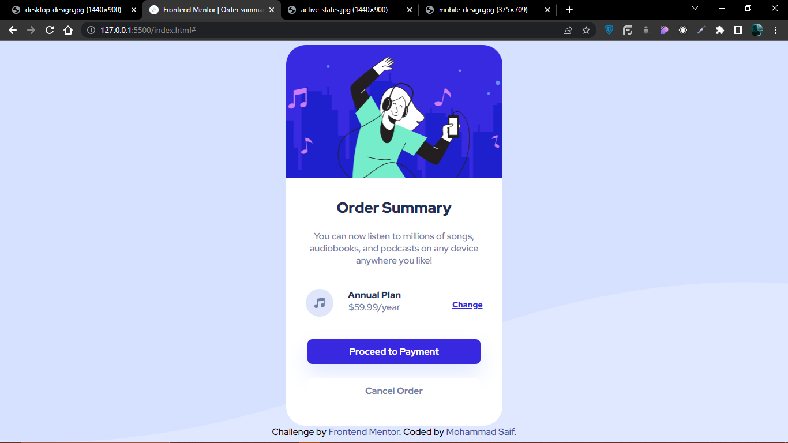

# Frontend Mentor - Order summary card solution

This is a solution to the [Order summary card challenge on Frontend Mentor](https://www.frontendmentor.io/challenges/order-summary-component-QlPmajDUj). Frontend Mentor challenges help you improve your coding skills by building realistic projects.

### The challenge

Users should be able to:

- See hover states for interactive elements

### Screenshot

### Links

- Solution URL: [Add solution URL here](https://github.com/Thebeast01/order-summary-component-main)
- Live Site URL: [Add live site URL here](https://thebeast01.github.io/order-summary-component-main/)

### What I learned

I Honed my HTML and CSS skills through this project.

## Author

- Frontend Mentor - [@Thebeast01](https://www.frontendmentor.io/profile/Thebeast01)
